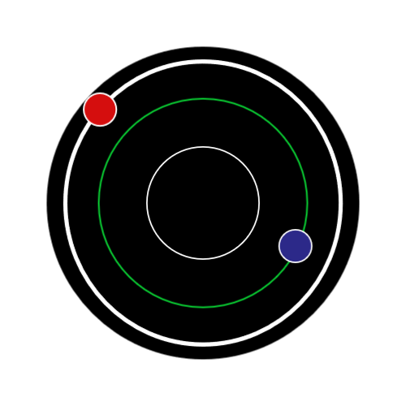
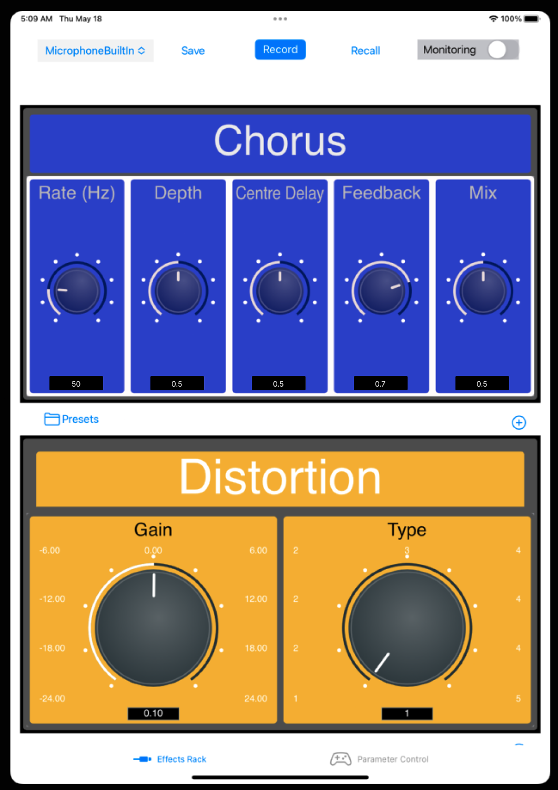

<!-- PROJECT LOGO -->
 

  

<h3 align="center">Kaoss Pad Type iOS Application for Real-time Audio Control</h3>

  

    iOS-based application that allows for the hosting and configuration of Audio Unit plugins for real time audio manipulation.
     
     
  

<!-- ABOUT THE PROJECT -->

### About The Project

 
There currently exists a market gap for the dynamic control and automation of musical-based effects in the iOS ecosystem. This project allows for the hosting and configuration of Audio Unit Plugins (specifically of the AUv3 standard) in a serial signal path. Further, the system was designed to accept audio data from a connected input device (via Line-in or USB-C) to be effected by the loaded units. The project emulates and expands upon effect parameter control features found in current iOS music applications, the Omnisphere’s Orb controller and the Korg Kaoss Pad - a performance based multi-effects processor.

 

 

       

(<a href="#readme-top">back to top</a>)

### Built With

UIKit & SwiftUI for interface. Realm DB instance used for persisting automation, user presets and settings. Custom Audio Units for basic effect types (Distortion, Chorus, Delay, Reverb, EQ) develped with JUCE. Combine framework used for asynchronous event / data processing. Sprite-kit / Core Motion enabled intuitive gesture control.

* [![Swift][Swift.js]][Swift-url]
* [![C++][Cplusplus.js]][Cplusplus-url]
* [![Realm][Realm.js]][Realm-url]

(<a href="#readme-top">back to top</a>)

<!-- USAGE EXAMPLES -->
## Usage / Features

https://github.com/SquilliamWimkins/KaossPad-iOS/assets/149274518/e7f7b087-8237-47cd-9312-b27d2dc69f63

https://github.com/SquilliamWimkins/KaossPad-iOS/assets/149274518/3125379a-455d-4666-bd8c-549cb822616c

<video width="320" height="240" controls>
  <source src="images/AUHost-3 copy.mp4" type="video/mp4">
</video>

___

- Load AUv3 Audio Units. Configure parameters. Save configuration as preset at individual or chain level.
- Map available Audio Unit parameters to control mechanisms.
- Automate and control modulation sources using (physics interactable) LFO generator. Save / Record Configurations.
- Record audio output to device.

(<a href="#readme-top">back to top</a>)

<!-- MARKDOWN LINKS & IMAGES -->
<!-- https://www.markdownguide.org/basic-syntax/#reference-style-links -->
[product-screenshot1]: images/screenshot1.png
[Swift.js]: https://img.shields.io/badge/Swift-FA7343?style=for-the-badge&logo=swift&logoColor=white
[Swift-url]: https://www.apple.com/uk/swift/
[Cplusplus.js]: https://img.shields.io/badge/C%2B%2B-00599C?style=for-the-badge&logo=c%2B%2B&logoColor=white
[Cplusplus-url]: https://cplusplus.com/
[Realm.js]: https://img.shields.io/badge/Realm-39477F?style=for-the-badge&logo=realm&logoColor=white
[Realm-url]: https://realm.io/
